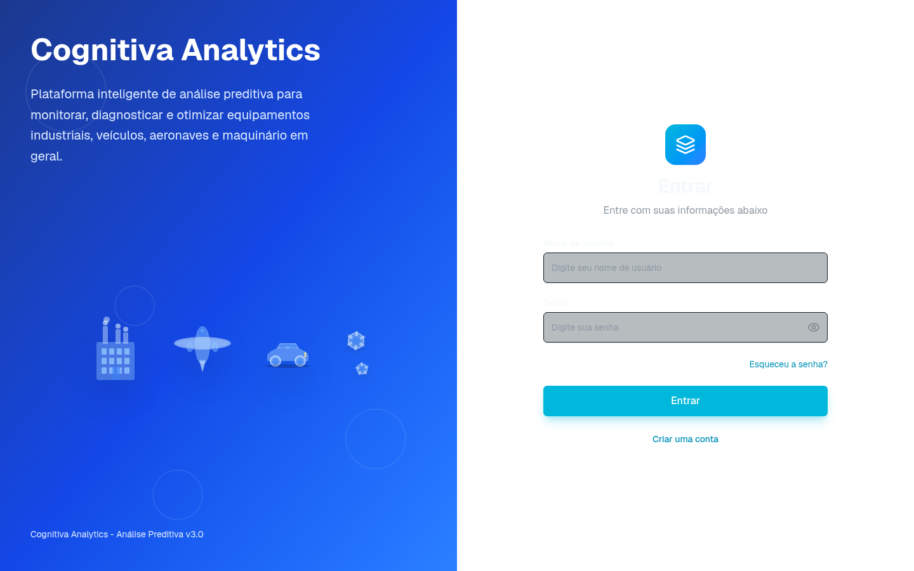
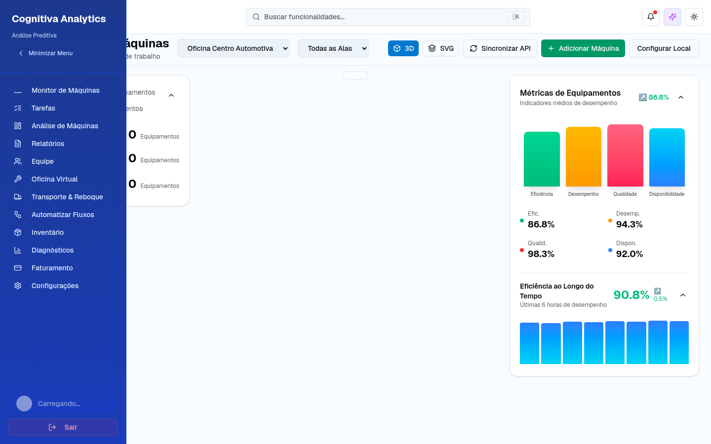
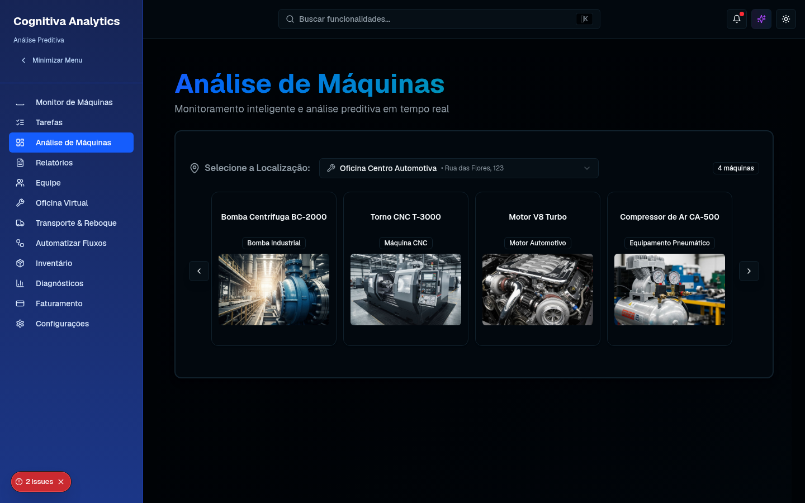

# Cognitiva Analytics

> Plataforma de análise preditiva para monitorar, diagnosticar e otimizar equipamentos industriais, veículos e aeronaves.

[](https://nextjs.org/) [](https://react.dev/) [](https://www.typescriptlang.org/) [](https://tailwindcss.com/) [](https://vercel.com/)

[](#acesso-de-demonstração) [](#licença)

## Índice

- [Visão geral](#visão-geral)
- [Recursos](#recursos)
- [Tecnologias](#tecnologias)
- [Acesso de demonstração](#acesso-de-demonstração)
- [Executando localmente](#executando-localmente)
- [Arquitetura de dados](#arquitetura-de-dados)
- [Stack original do projeto Next](#stack-original-do-projeto-next)
- [Screenshots](#screenshots)
- [Texto para LinkedIn](#texto-para-linkedin)
- [Deploy](#deploy)
- [Licença](#licença)

## Visão geral

O Cognitiva Analytics é um dashboard responsivo para análise de saúde de máquinas e ativos. A experiência inclui indicadores operacionais, diagnósticos, inventário, tarefas, relatórios, monitoramento, mapas e visualizações 3D.

Esta versão é uma demonstração autocontida: os dados e a autenticação são simulados para facilitar a avaliação da plataforma sem configurar banco de dados ou serviços externos.

## Recursos

- **Dashboard operacional:** indicadores, status e eficiência dos ativos.
- **Análise de máquinas:** métricas de temperatura, vibração, pressão e uso.
- **Gestão de operações:** tarefas, equipes, funcionários, oficinas e transportes.
- **Relatórios e diagnósticos:** visualizações e recomendações para manutenção.
- **Experiência responsiva:** navegação desktop e mobile com modo claro/escuro.
- **API mock:** endpoints locais em `app/api/mock` para alimentar a interface.

## Tecnologias

| Camada | Tecnologias |
| --- | --- |
| Interface | Next.js App Router, React, TypeScript |
| Estilo | Tailwind CSS 4, shadcn/ui, Radix UI |
| Visualização | Recharts, Mapbox, React Three Fiber |
| Dados temporários | JSON local, endpoints mock e `localStorage` |
| Deploy | Vercel |

## Acesso de demonstração

Na tela `/login`, use um dos perfis abaixo ou clique no cartão do perfil para preencher os campos automaticamente:

| Perfil | Usuário | Senha | Escopo |
| --- | --- | --- | --- |
| Administrador | `vynnydev` | `123456` | Acesso completo à plataforma |
| Demonstração | `demo` | `demo` | Acesso de visitante |

> **Nota:** estes são dados públicos de demonstração. Não use credenciais reais neste ambiente.

## Executando localmente

```bash
pnpm install
pnpm dev
```

Depois, abra [http://localhost:3000/login](http://localhost:3000/login).

Para validar o projeto:

```bash
pnpm lint
pnpm build
```

## Arquitetura de dados

A aplicação não depende de banco de dados nesta versão. Os dados de negócio são fornecidos por arquivos mock e rotas em `app/api/mock`. A sessão do usuário autenticado é mantida temporariamente no navegador por meio de `localStorage`, permitindo navegar pelo dashboard durante a demonstração.

Para uma versão de produção, substitua a camada mock por uma API protegida e implemente autenticação, persistência, autorização por papel e armazenamento seguro de sessão.

## Stack original do projeto Next

Na apresentação original do projeto desenvolvido para o festival de tecnologia **Next, da FIAP**, a solução foi concebida com uma arquitetura distribuída baseada em:

- Microfrontends e deploy na AWS Amplify.
- AWS Lambda para microserviços.
- Amazon MQ para mensageria entre serviços.
- Amazon S3 para armazenamento dos arquivos coletados das máquinas.
- Amazon Athena e Amazon QuickSight para consultas e análises.
- Amazon Bedrock com Claude para análises inteligentes dos arquivos.
- AWS IoT Core para ingestão e comunicação com os equipamentos.
- Amazon DynamoDB para telemetria, eventos e dados de alta escala.
- Amazon RDS for PostgreSQL para dados relacionais, configurações, usuários e histórico operacional.

### RDS PostgreSQL e DynamoDB fazem sentido juntos?

Sim. É um caso de uso de persistência poliglota: o **RDS PostgreSQL** é adequado para dados relacionais e transacionais, enquanto o **DynamoDB** funciona melhor para telemetria, eventos e leituras de baixa latência em grande volume. A recomendação é definir claramente a fonte de verdade de cada domínio e evitar duplicar o mesmo dado nos dois bancos sem uma estratégia de sincronização.

## Screenshots

### Login



### Dashboard e monitoramento de máquinas



### Análise de máquinas



## Texto para LinkedIn

> Hoje recebi as fotos da minha formatura e elas me fizeram lembrar de um projeto muito especial: a plataforma **Cognitiva Analytics**, desenvolvida para ser apresentada no festival de tecnologia **Next, da FIAP**.
>
> Na época, tive a oportunidade de apresentar o projeto ao lado da **Anna, do Robélio e do Vitor**, e conquistamos o **2º lugar** com a nossa equipe. Por conta de outros imprevistos e do tempo, acabei compartilhando a plataforma no LinkedIn antes de publicar este registro.
>
> A solução foi construída com **microfrontends**, AWS Amplify, AWS Lambda, Amazon MQ, AWS IoT Core, Amazon S3, Amazon Athena, Amazon QuickSight, Amazon Bedrock com Claude, Amazon DynamoDB e Amazon RDS for PostgreSQL. O objetivo era coletar e analisar dados de máquinas, combinando telemetria, mensageria, analytics e inteligência artificial para apoiar a manutenção preditiva.
>
> Rever este projeto quase um ano depois reforça o quanto aprendi sobre arquitetura distribuída, cloud e trabalho em equipe. Obrigado, Anna, Robélio e Vitor, por fazerem parte dessa jornada.

## Deploy

O projeto está preparado para deploy na [Vercel](https://vercel.com/). A aplicação também é sincronizada com o [v0](https://v0.app/chat/eazSv8nVeHs).

## Licença

Este projeto é uma demonstração proprietária da Cognitiva Analytics. Consulte os responsáveis pelo repositório antes de reutilizar o código ou os ativos.
